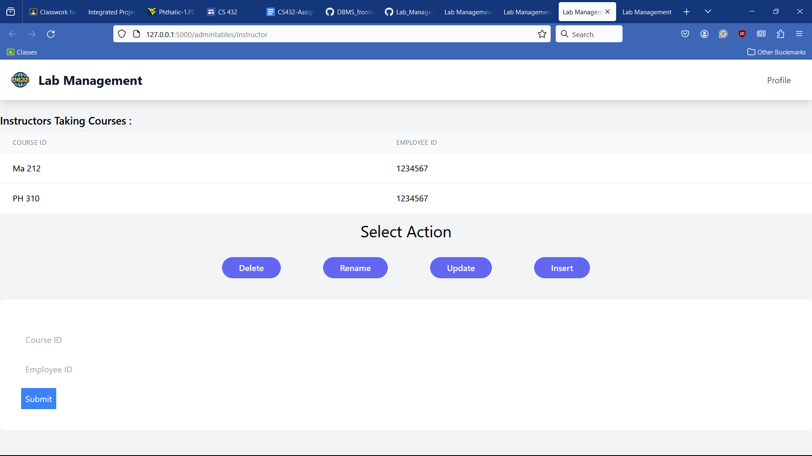
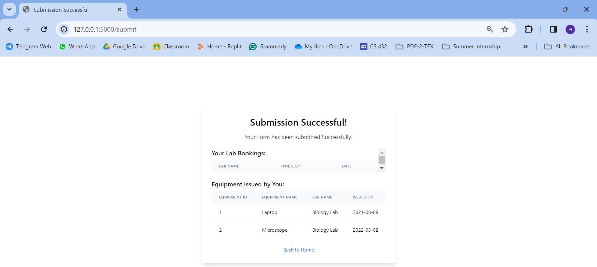

# CS 432-Assignment 3 

## Table of Contents:

- [CS 432-Assignment 3](#cs-432-assignment-3)
  - [Table of Contents:](#table-of-contents)
  - [Introduction:](#introduction)
  - [Steps to run Web-app:](#steps-to-run-web-app)
  - [Login Page:](#login-page)
  - [Hero Page:](#hero-page)
  - [3.3.1: Creating Dummy Database](#331-creating-dummy-database)
  - [3.3.2: Section-2 Dynamic Execution](#332-section-2-dynamic-execution)
    - [1. INSERT:](#1-insert)
    - [2. UPDATE](#2-update)
    - [3. DELETE](#3-delete)
    - [4. WHERE](#4-where)
    - [RENAME:](#rename)
  - [Views:](#views)
    - [1. Admin:](#1-admin)
    - [2. Staff:](#2-staff)
    - [3. Professor:](#3-professor)
    - [4. Student:](#4-student)
  - [Webpage:](#webpage)
  - [Contributions:](#contributions)

## Introduction:

This lab management website, created by SQL Dummies, is a platform designed to organize and enhance the management of laboratories, offering a comprehensive solution for professors, students, lab technicians, and administrators alike. It offers multiple features such as providing lab details, managing inventory, regulating course administration, booking labs, keeping profiles of professors and students, etc. A login/registration page allows different views to the database, allowing admins to delete, rename, update and insert data, while restricting students to lab booking and issuing tools. All our data is stored in an optimized database, which is currently tested using dummy data. Various tools such as HTML, CSS, Tailwind, etc. are used for frontend, and MySQL and Flask are used to create a smooth interaction to the databases. Detailed information about the features are given below.

<br><br>
## Steps to run Web-app:
1. Install the libraries for requirements.txt:
<code> pip install -r requirements.txt</code>    
3. Clone the repository : [`<`link`>`](https://github.com/kaushal-003/DBMS_frontend) 
 Terminal: `git clone https://github.com/kaushal-003/DBMS_frontend`
 <br><br>
4. Run the SQL script in the MySQL Workbench:
    - Go to File > Run SQL script.. choose the .sql file([sql script](src\bookings.sql), and click Run.
    
    <br>
      **Note:** The database should be visible in navigation pane: 
    <br>
    - This script will create a database called lab_bookings, corresponding tables, and it will insert some pre-required data into the tables.
  <br><br>
5. Run the app.py code. 
    <br>
    <code>python app.py</code>

## Login Page:


## Hero Page:


## 3.3.1: Creating Dummy Database
```
LOCK TABLES `students` WRITE;
/*!40000 ALTER TABLE `students` DISABLE KEYS */;
INSERT INTO `students` 
VALUES 
(11637578,'Anthony',NULL,'Marquez',2017,'BTech',0,'Investigation','CSE','anthony.marquez@example.com',1234567890,1),
(12278656,'Angela','Daniel','Martin',2019,'BTech',0,'Documentation','ME','angela.martin@example.com',1234567891,1),
(14790536,'Daniel','Richard','Scott',2021,'MTech',0,'Calibration','MSE','daniel.scott@example.com',1234567892,1);
/*!40000 ALTER TABLE `students` ENABLE KEYS */;
UNLOCK TABLES;


LOCK TABLES `staff` WRITE;
/*!40000 ALTER TABLE `staff` DISABLE KEYS */;
INSERT INTO `staff` VALUES (1090324586,'Antonio','Candice','Fritz',21076.4,'Assistant','Anatomy Lab','antoniofritz@example.com',7513498620, 'https://drive.google.com/file/d/19uY3X76bigNjiPrmo-qrM6UUFvoXbNCc/view?usp=sharing', 'man wearing proffessional attire _ img1',1),
(1175259019,'Larry',NULL,'Clark',48988.8,'Researcher','Biochemistry Lab','larryclark@example.com',2385167904, 'https://drive.google.com/file/d/1UVrg23vtXXhAelbIsNwhuPQ60PapMhlK/view?usp=sharing', 'man wearing proffessional attire _ img2',1),
(1357028218,'Cody',NULL,'Lopez',38466.9,'Assistant','Biology Lab','codylopez@example.com',6975814320, 'https://drive.google.com/file/d/1UCkE2pw8BxXX4HAkfJ6hvuPbd5Hff7ww/view?usp=sharing', 'man wearing proffessional attire _ img3',1),
(1396986120,'Jessica',NULL,'Frost',71804.4,'Researcher','Botany Lab','jessicafrost@example.com',4297681053, 'https://drive.google.com/file/d/1rck0DeK398QA4zGW1cJANB5aupO1U0Qp/view?usp=sharing', 'man wearing proffessional attire _ img4',1);
/*!40000 ALTER TABLE `staff` ENABLE KEYS */;
UNLOCK TABLES;
```
<br>


<br><br>

## 3.3.2: Section-2 Dynamic Execution 


### 1. INSERT:
***a. ADMIN VIEW:***

 In course_slot table:
    
Before: 

After: 
  <br><br>

    In student table:
    
Add: 

Before: 

After: 
  <br><br>


### 2. UPDATE

***a. ADMIN VIEW:***

    In student table:
    
Before: 

After: 

    In Staff table:
    
Before: 

After: 

### 3. DELETE

***a. ADMIN VIEW:***

    In student table:
    
Before: 

After: 

    In Staff table:
    
Before: 

After: 


### 4. WHERE

***a. ADMIN VIEW:***

    In lab_booking table:
    
Data: 

Before: 

After: 

### RENAME:


## Views:
### 1. Admin:

{:  }

### 2. Staff:
{:  }


### 3. Professor:

Profile:
{:  }

{:  }

### 4. Student:
profile:
{:  }

{:  }


## Webpage:


{:  }

{:  }

{:  }

{:  }

{:  }

{:  }

{:  }

{:  }

{:  }

{:  }

{:  }

{:  }

{:  }

{:  }

{:  }

{:  }

{:  }

{:  }

{:  }

{:  }

{:  }

{:  }

{:  }

{:  }

{:  }

{:  }

{:  }

{:  }

{:  }

{:  }


## Contributions:


